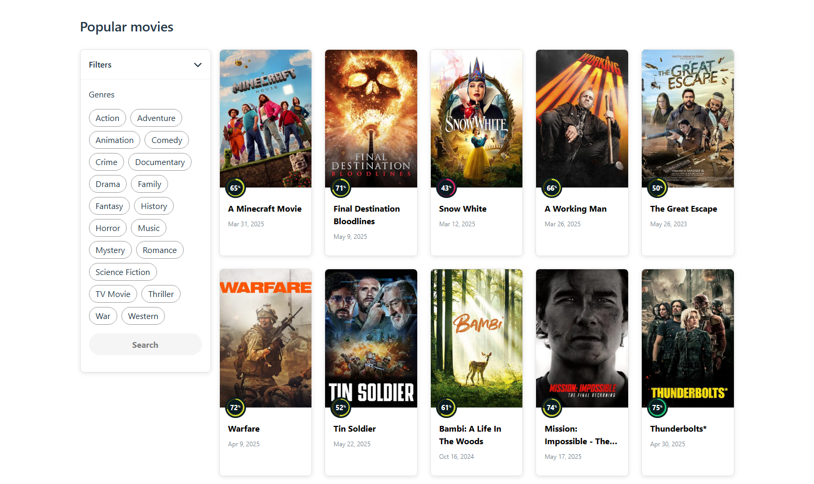

# Agiledrop Assignment

A React-based movie browsing app that lets users filter and explore popular movies by genres. It fetches data from The Movie Database (TMDB) API and supports infinite scrolling and manual load-more functionality.

## Features

- Browse movies by selected genres
- Infinite scrolling to load more movies as you scroll down
- Manual "Load More" button for pagination control
- Responsive movie grid layout (mobile, tablet and desktop supported)
- Error handling and empty state messaging
- Throttled scroll event for opštimized performance

## Tech Stack

- React (with hooks)
- TypeScript
- TMDb API for movie and genre data
- Lodash for utility functions (throttle)
- SCSS for styling

## Setup

1. Clone the repo
2. Install dependencies with `npm install`
3. Add your TMDB API key in the .env file named VITE_TMDB_API_KEY=YOUR_APY_KEY
4. Run the app with `npm run dev`

## Notes

- The "Load More" button appears initially and disappears once infinite scrolling is active.
